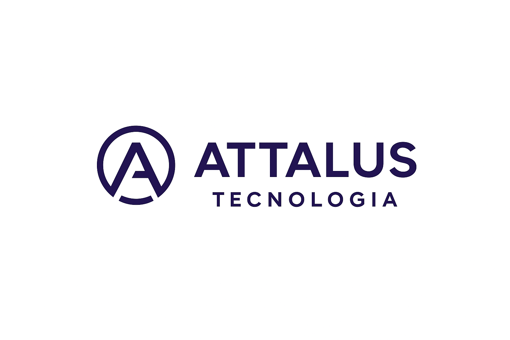

# ATTALUS Tecnologia — Home Lab Corporativo

---

Bem-vindo ao repositório oficial da **ATTALUS Tecnologia**, um laboratório prático voltado para **Redes, Infraestrutura, Segurança da Informação e boas práticas corporativas de TI**.  
O projeto simula a operação de uma pequena empresa de tecnologia, permitindo construir um ambiente profissional real: topologia, servidores, automações, segurança e documentação estruturada.

Este repositório também funciona como **portfólio profissional**, registrando a evolução técnica do ambiente e demonstrando conhecimento sólido em redes e infraestrutura.

---

# 🏢 Sobre a ATTALUS Tecnologia

A **ATTALUS Tecnologia** é uma empresa fictícia criada como base para o PROJETO ATTALUS — um homelab corporativo destinado a:

- aplicar conceitos reais de redes e infraestrutura;  
- estruturar servidores e serviços internos;  
- desenvolver boas práticas de documentação;  
- testar cenários corporativos reais;  
- evoluir tecnicamente com organização e disciplina.

Todo o ambiente é documentado e versionado seguindo padrões profissionais.

---

# 🎯 Objetivos do Projeto

- Construir uma infraestrutura funcional com **Mikrotik + Servidor + VMs**  
- Praticar boas práticas de **rede, configuração e segurança**  
- Criar documentação profissional e escalável  
- Simular um ambiente real de TI corporativa  
- Consolidar conhecimentos essenciais para a carreira em Redes/Infra  

---

# 📚 Estrutura do Repositório

    assets/                    → Logos, diagramas e arquivos visuais
    docs/
      jornada/                 → Documentação numerada (00-07): histórico e decisões do projeto
      referencia/
        infra/                 → Infraestrutura: servidores, monitoramento, virtualização
        rede/                  → Documentação de rede
        operacoes/              → Documentação operacional
        seguranca/               → Documentação de segurança
    infra/
      mikrotik/backups/         → Backups de configuração (.rsc) do Mikrotik
    LICENSE
    README.MD
---

# 🗂 Documentação Principal

A documentação central está organizada de forma sequencial:

- [00 — Visão Geral](https://github.com/gabrielmviana/attalus-tecnologia/blob/main/docs/jornada/00-visao-geral.md)
- [01 — Planejamento e Fases](https://github.com/gabrielmviana/attalus-tecnologia/blob/main/docs/jornada/01-planejamento.md)
- [02 — Topologia da Rede](https://github.com/gabrielmviana/attalus-tecnologia/blob/main/docs/jornada/02-topologia.md)
- [03 — Configurações](https://github.com/gabrielmviana/attalus-tecnologia/blob/main/docs/jornada/03-configuracoes.md)
- [04 — Segurança](https://github.com/gabrielmviana/attalus-tecnologia/blob/main/docs/jornada/04-seguranca.md)
- [05 — Monitoramento](https://github.com/gabrielmviana/attalus-tecnologia/blob/main/docs/jornada/05-monitoramento.md)
- [06 — Políticas](https://github.com/gabrielmviana/attalus-tecnologia/blob/main/docs/jornada/06-politicas.md)
- [07 — Melhorias / Roadmap](https://github.com/gabrielmviana/attalus-tecnologia/blob/main/docs/jornada/07-melhorias.md)

---

# 🛠 Tecnologias Utilizadas

- **Mikrotik RouterOS**  
- **Linux (Ubuntu / Debian)**  
- **Windows Server**  
- **Virtualização:** VirtualBox (inicial), Proxmox (planejado)  
- **Ferramentas de Monitoramento:** Zabbix / Grafana / Prometheus (futuro)  
- **Documentação:** Markdown + diagramas técnicos  

---

---

# 🧠 Portfólio Profissional

Este projeto demonstra:

- visão de arquitetura;  
- documentação corporativa clara;  
- habilidades práticas em redes e infraestrutura;  
- organização de ambientes corporativos;  
- capacidade de evolução contínua;  
- domínio real de ferramentas utilizadas no mercado.

Ideal para apresentação em entrevistas técnicas e processos de seleção.

---

# 📄 Licença

Este projeto está licenciado sob a **MIT License**.

